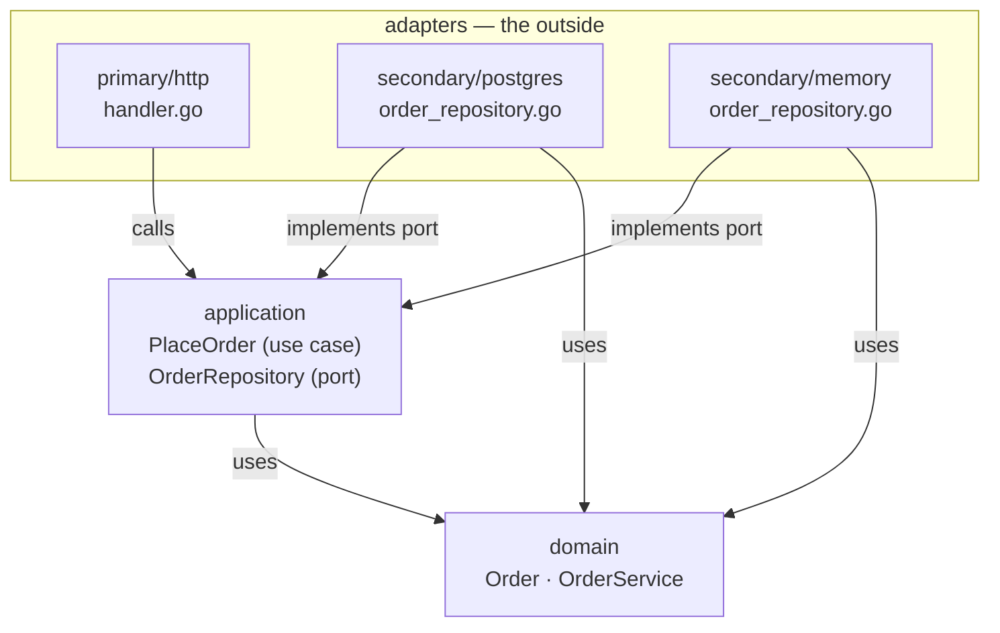
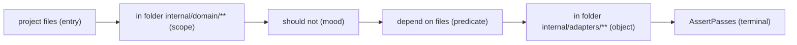
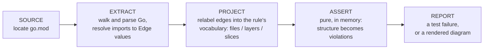
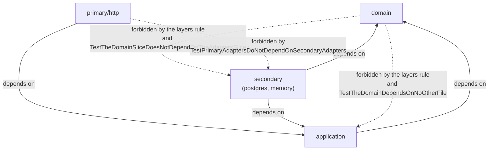

# ArchUnitGo demo — a hexagonal "orders" service

A tiny Go project whose only job is to be a good demo of
[ArchUnitGo](../README.md): a hexagonal architecture, kept honest by architecture
rules written as ordinary `go test` functions.

## The architecture

The project is a hexagon: a pure **domain** in the middle, a thin **application**
ring around it, and **adapters** on the outside. Dependencies point inwards only —
adapters → application → domain — and that single direction is what the tests
police.



Three rings, two of them split in two:

- **domain** — the entities (`Order`) and the business rules (`OrderService`).
  It knows nothing about HTTP, databases, or the rest of the project.
- **application** — the use cases (`PlaceOrder`) and the *ports*. A port is an
  interface like `OrderRepository`, declared by the core, that says "somebody must
  store orders" without saying who.
- **adapters** — the outside world. The *primary* (driving) side turns requests
  into use cases (`primary/http`); the *secondary* (driven) side implements the
  ports (`secondary/postgres`, `secondary/memory`).

The direction of every arrow in the diagram is the rule. If `domain` ever imports
`application`, the hexagon has a hole, and a test should say so.

## Layout

```
cmd/
  server/            wiring: memory adapter -> use case -> http adapter
  diagram/           draws the dependency graph (ArchUnitGo graph module)
internal/
  domain/            entities + domain rules — no dependencies
  application/       use cases + the port (OrderRepository interface)
  adapters/
    primary/http/    driving adapter (REST)
    secondary/       driven adapters (postgres, memory)
architecture/        the architecture tests (ArchUnitGo rules)
demo.sh              the 10-minute demo script
```

The `demo/` directory is its own Go module; `go.mod` points at the parent module
with a `replace` directive, so the tests run against the working tree of ArchUnitGo
itself.

## What a rule looks like

Every rule is one chain that reads left to right as an English sentence. Each stage
is one word of it:



That chain is the whole of a test:

```go
func TestTheDomainDoesNotDependOnTheAdapters(t *testing.T) {
	rule := archunit.ProjectFiles(nil).          // project files
		InFolder("internal/domain/**").          //   in folder ...
		ShouldNot().                             //   should not
		DependOnFiles().                         //   depend on files
		InFolder("internal/adapters/**")         //   in folder ...

	archunit.AssertPasses(t, rule, nil)          // the terminal
}
```

Two things worth internalising:

- **A rule is a value, not an action.** Building the chain reads nothing; only the
  terminal `check` touches the project. `AssertPasses` is that terminal plus the
  test failure.
- **Empty selection fails by default.** A selector that matches no file is almost
  always a typo or a renamed folder, so the library reports it instead of passing
  silently.

## What happens when a rule runs

ArchUnitGo turns the codebase into a directed dependency graph, then judges the rule
against it. Five stages, one per word of the pipeline:



Only `EXTRACT` knows Go. The rest is the same machinery the sibling ports
(ArchUnitTS, ArchUnitPython) use, which is how one product feels the same in four
languages.

## How we test it

The rules live in
[`architecture/architecture_test.go`](architecture/architecture_test.go). The
green arrows are what the architecture *is*; the dashed arrows are what the tests
refuse to let happen — each labelled with the test that guards it.



The full set of rules, one test per rule:

| Test | Family | What it enforces |
|---|---|---|
| `TestTheLayersFlowInwards` | layers | the whole hexagon as one named-layer policy |
| `TestTheDomainDependsOnNoOtherFile` | files | the domain imports no project code |
| `TestTheDomainDoesNotUseThirdPartyLibraries` | files | the domain imports no third-party module |
| `TestPrimaryAdaptersDoNotDependOnSecondaryAdapters` | files | the two adapter sides never meet directly |
| `TestNoCircularDependencies` | files | no cycle anywhere under `internal/` |
| `TestSecondaryAdaptersAreNamedAsRepositories` | files | a naming convention |
| `TestTheDomainStaysSmall` | metrics | domain files stay under 100 lines |
| `TestTheDomainSliceDoesNotDependOnTheAdaptersSlice` | slices | a forbidden dependency |
| `TestTheAdaptersSliceReachesTheApplicationSlice` | slices | a *required* dependency |

Five families, one grammar. `layers` says the whole thing in one sentence; `files`
says one boundary; `slices` says a boundary in a different vocabulary; `metrics`
holds numbers; the `graph` module (used by `cmd/diagram`) draws instead of judges.

## Running it

```sh
go test ./...            # all architecture rules
go test ./... -v         # see each rule run and pass by name
```

Each test is one rule, named the way the rule reads, so a single rule runs on its own:

```sh
go test ./architecture -run TestTheLayersFlowInwards -v
```

Or run the whole thing as a live, narrated walkthrough (pauses between beats):

```sh
./demo.sh
```

## Drawing the architecture

```sh
go run ./cmd/diagram
```

writes two files, both generated from the real dependency graph, not drawn by hand:

- `docs/architecture.mmd` — the raw Mermaid source, straight from ArchUnitGo's
  `ExportAsMermaid` terminal. Renders as a picture on GitHub and anywhere Mermaid
  is understood.
- `docs/architecture.html` — the same diagram rendered in a browser. ArchUnitGo's
  own `ExportAsHTML` terminal is deliberately script-free and self-contained, so it
  cannot lay a graph out (that would mean shipping a JS layout engine or fetching
  one). The demo's `cmd/diagram` therefore wraps `ToMermaid`'s output in a small
  page that loads mermaid.js from a CDN — needs a network connection, which is fine
  for a demo.

## The demo moment — break it and watch it bite

Architecture tests are only interesting when they can fail. Add this to the top of
`internal/domain/order.go`:

```go
import "github.com/LukasNiessen/ArchUnitGoDemo/internal/application"

var _ = application.PlaceOrder{}
```

and re-run:

```sh
go test ./architecture -run TestTheLayersFlowInwards -v
```

The domain now reaches outward, and three rules report it, each naming the exact
import:

```
--- FAIL: TestTheLayersFlowInwards
    architecture_test.go:37: project layers, layer "domain" defined by ... where
    layer "domain", may only depend on no layers, where ...
        1 violation:
          1. layer "domain": may only depend on no layers; it depends on
             application through internal/domain/order.go -> internal/application/place_order.go
```

Delete the two lines and it is green again — or just let `./demo.sh` do the whole
break-and-restore for you.
